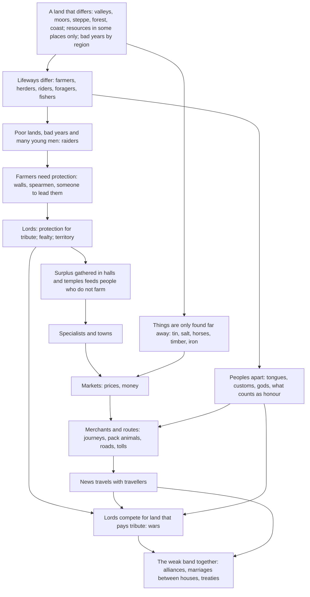

# The grand world: a plan

Written 2026-10-09 at the owner's request: "Right now it's just a world where everyone is kind of doing the
same thing and everything is fairly peaceful and uneventful. I want things to be much more grand… trade routes,
people more specialized. Merchants and lords, separate cultures and tribes, backwards hill people and cultured
cities. Raiders and farmers. Wars and alliances… first and foremost this is a game of AI people living in a
world. The bots are here to flesh it out."

This plan is meant to be read before [roadmap.md](roadmap.md). Once the owner settles the decisions in §13, its
phases (§8) replace that file's section 5 as the order of work. Nothing here changes the rules that bind
everything: the engine owns the world, the people only choose; mechanics, never scripted outcomes; nothing
hidden; the people never learn they are simulated; free tiers only.

---

## 0. In one page

**What is wrong is scope and structure, not the foundations.** world2 has one people on one small, even land.
Every household is self-sufficient, everyone is able at about nine crafts, and surplus has nowhere to go: it
piles up on the ground. Conflict is one person striking another. The 48 AI people are farmhands chosen at
random, seeing an 11×11 patch of land. A group leader with nine followers spends their thoughts on reaping
grain. Nothing in the world *needs* a merchant, a lord, a raider or a city, so none appear.

**What the grand world needs, in one sentence:** a land of real differences, so that peoples live differently
and need one another, inhabited by peoples who are strangers to one another, where surplus has to go
somewhere, where force can be organised, and where the AI people sit in the seats that move all of this and
command the bots who fill it.

**Build on `civ/`; start a new world.** Keep:
- the content system;
- the shared executor;
- the recipe planner;
- the society primitives;
- the language-model pipeline and its operations;
- the viewer.

Add, in the same code base:
- a continent generator with regions;
- peoples (cultures, tongues, customs);
- settlements;
- polities with fealty and territory;
- organised force;
- news and renown;
- role-shaped bots;
- prompts shaped by a person's station.

The new world, **world4**, starts in the middle of history (towns, hill clans, nomads, old grudges), grown by a
bots-only prehistory and then handed to the AI people. world2 runs until then. No language rewrite is needed:
the engine's time goes to resource search and pathing, which Python can do about five times faster.

**The first three steps** (§8, Phase 1):
1. Make surplus go somewhere: things on the ground decay, and bots make things only for a need.
2. Make the engine fast enough for thousands.
3. A cheap early test on world2 of the idea everything rests on: an AI leader who commands their people.

---

## 1. The picture

*What the owner sees on the phone, some forty years into world4. The names are examples; the world makes its
own.*

**The land.** The land is wide: a fortnight's walk from the salt marshes of the south coast to the
northern moors. The **Ashwater** winds through the middle of it, a broad valley of black soil, and on its banks
stand the only towns. The largest is **Greenford**, where the river can be crossed:
- 180 people;
- a wall of earth and timber;
- a market of thirty stalls;
- a temple to the river mother;
- a hall where the ruling house keeps its grain.

Most of Greenford's people never touch a field. They are:
- potters, weavers and bronzesmiths;
- the lady's spearmen;
- a scribe who keeps her tallies;
- two families of merchants.

They eat grain carried in from the villages up and down the valley, which pay it to the hall each autumn.

**The lady of Greenford.** Ysolde is an AI person, the third of her house to hold the hall, and the first to
read. Her grandfather was a farmer whose neighbours paid him to keep the hill clans off. Her father took
tribute from eleven villages. She has these in hand:
- grain in the hall, counted in days;
- spearmen she can call;
- villages that owe her and those that are late;
- an envoy who walked north a week ago, and has not returned;
- a river lord downstream who has married his daughter into the house of her rival.

She thinks about once a day and decides things that move a hundred people: the toll at the ford, whom to feast,
whether to wall the eastern villages, and what to offer the hill chief.

**The hill clans.** North of the valley the land rises into moor and crag. There the **Brannoch** clans graze
sheep and cattle. Their life looks like this:
- They live in turf houses and speak a tongue the valley people cannot follow.
- Their chief has always been the boldest, never the eldest son.
- To them, cattle taken from strangers bring honour, not shame.
- They are poor in grain and rich in sons.
- Their hills hold the copper and the only tin anyone knows of, which they barely work. They trade ore for
  grain when the year is good.

When the moor grass fails (and on the moors it fails one year in five), they come down the Ashwater in the
first frosts, thirty spears at a time, and take what the valley has stored.

Their chief, **Gorvach**, is an AI person. He has 40 men who follow him because:
- he fed them through the bad winter;
- he gave the bronze from the last raid away, not into his own house.

**The steppe riders.** East, beyond a line of hills with one pass, the grass goes on forever. The **Ulai** follow
their horses there. They:
- live in tents they strike and carry;
- trade horses and hides at the pass;
- raid the caravans that do not pay them;
- marry their chiefs' daughters to whoever is strongest.

**The forest folk.** Westward lies old forest, where a few hundred **Tavren** live much as everyone lived three
hundred years before. They hunt, gather and know the herbs, and they have no metal. People in Greenford call
them backward. The Tavren call Greenford a place where people forget the names of their grandmothers.

**The merchant.** One merchant, **Tamo**, an AI person, has made the long route his life. In spring he walks a
string of eight donkeys:
1. from Greenford with cloth and bronze pins;
2. through the Ulai pass, where he pays the horse-chief a toll in salt;
3. to the mining hamlets at the mountain's foot, where he buys copper;
4. home by the river in autumn, before the clans come down.

He speaks three tongues, valley, hill and horse. His tablets of debts owed to him in four settlements are worth
more than his donkeys. When he reaches a market, word goes ahead of him. The trail he walks has become a road,
because so many walk it.

**The war.** In year 37 the hill clans did not come down to raid. They came to stay:
- Gorvach took a valley village with no wall, made its people swear to him, and began taking its tribute.
- Ysolde sent word to the river lord downstream, her rival's ally. The envoy was an AI person, her younger
  brother, who wanted her seat. He was gone nine days.
- The river lord agreed, for a marriage and the toll of the ford for five years.
- The two lords' spearmen met Gorvach's band at the ford of Ashby in the autumn rain. Forty fought; eleven died,
  six of them Brannoch.
- Gorvach went back to the hills with a written peace on a clay tablet. He took no village. He did take a
  promise of forty measures of grain a year, which in the valley they call alms and in the hills they call
  tribute.

**What the owner sees.** None of the above was written by anyone. It came from:
- a land that differs;
- peoples who differ;
- a dozen mechanics;
- some sixty AI people making choices;
- two thousand bots filling the villages, the fields, the spear-lines and the market stalls.

The viewer shows:
- the **atlas**: the land coloured by peoples and lordships, roads thickening where trade runs, a band of spears
  moving down a valley;
- the **chronicle**: reigns, wars, famines and treaties;
- a **house's page**: the family tree and who sits in the hall;
- the **3D land**, where you can follow Tamo down the road, or Ysolde into her hall, and hear what is said.

TV mode's storyteller goes where things are happening: a raid, a battle, a wedding between houses, a feast.

---

## 2. How the picture is made: one web of causes

Grandeur cannot be added piece by piece. A merchant with nothing to carry, a lord with no one to protect, or a
raider with nothing to raid will each sit idle, as markets and writing did for months in world2. The pieces
cause one another. This is the web the plan builds, and every arrow is a mechanic in §6 and §7:

Read from the top, each step is a reason, not a script:
- **Raiders appear** because some lands cannot feed their people in a bad year, and their neighbours store grain.
- **Lords appear** because farmers who are raided will pay for protection.
- **Towns appear** because tribute gathered in a hall feeds people who no longer farm, and because they need
  walls.
- **Merchants appear** because tin is found only in the hills and salt only by the sea, and because a person
  who speaks two tongues can buy where others cannot.
- **Wars and alliances appear** because tribute-paying land is worth fighting for, and the weak are safer
  together.

The AI people sit where these arrows cross: the hall, the war band, the caravan, the temple. There their choices
decide which way the arrows run.

---

## 3. Why today's world is small (world2 on 2026-10-09)

Read for this plan from world2's state (day 896, year 23) and its log of 2026-10-08:

| What | Number | What it means |
|---|---|---|
| Land | 96×96, one continuous mix of grass, forest and river | Everything is within a few days' walk; no region has anything the others lack for long |
| Peoples | 1: one name stock, one set of customs, kin-trust in every band | No strangers, so no "us and them" |
| Crafts per person | mean 8.9 able (median 8) | Everyone does everything; no one needs anyone |
| Farms | 535 for 417 people | Every household feeds itself |
| Groups | 80, the largest 10 | Households, not clans, tribes or realms |
| One real day of the world (136 world days) | 15,142 lines spoken, 3,495 things made, 202 deals, 37 posted trades, 34 thefts, 5 blows, 14 deaths | Busy and peaceful: people talk and make, but seldom exchange and almost never fight |
| On the ground around one leader | 241 wood, 213 fibre, 250 reeds, 98 rope, 24 hats, 61 grain | Surplus has no sink, so goods are worth nothing; there is nothing worth trading or raiding for |
| AI people | 48 of 417, chosen at random; about 0.6 decisions each per world day (2,400-4,000 a real day in all) | They are farmhands among farmhands, and they think less than once a day |
| What a leader sees | an 11×11 map, the people beside them, their own stores | Steakshan leads nine and owns 5 stores, 3 farms and a pen, and their plan is "gather grain 36; put grain 36" |
| What they say | "Winter is coming, let us ensure our stores are full" (many times a day) | Survival is the only stake the world shows them |
| Where the world began | foraging, year 0 | Twenty years spent climbing a ladder everyone shares; difference never had a chance to grow |

**Five root causes:**
1. **Sameness.** One land, one people, one lifeway.
2. **No scarcity that needs others.** Surplus piles up, and every skill is within everyone's reach.
3. **No distance.** Everything is a few days off, and nothing is known from far away.
4. **Force cannot be organised.** One person strikes another; no one can lead a band or hold land.
5. **The AI people have no leverage.** One decision moves one person for half a day.

Polish (fewer refusals, truer words) cannot fix any of these. They are the plan.

---

## 4. Rewrite, or build on what we have?

**Build on `civ/`.** It is a good platform, and what it lacks is additive. The reasons:

**Keep:**
- **Content as data:** 126 items, 45 crafts, 106 recipes, 44 buildings by role, and effects as hooks. New
  peoples, lifeways and eras are rows in data files, not code.
- **The executor:** every mind's steps carried out alike.
- **The planner:** bots can pursue any goal through the recipe tree.
- **Society primitives:** offers, promises, service, posted trades, groups, votes, laws, dues, writing,
  ledgers, witnesses, hearsay. Fealty, tribute and treaties are made from these.
- **64 rule versions of lessons** on how small models fail: forgiving steps, truthful refusals, refusals said
  back, the prompt budget. A rewrite would relearn them at the cost of weeks of Claude tokens.
- **Operations:**
  - the Kaggle and free-tier gateway;
  - hourly pieces;
  - automerge;
  - the bot farm, `civ_round.py`, `health.py`, `civ_balance.py`.
- **The 3D viewer** and its watching tools (Follow, TV mode, the journal).

**Rebuild or add:**

| Part | Now | Becomes |
|---|---|---|
| `gen.py` | one 96×96 land, bands of one people | a continent of regions, peoples with homelands and lifeways, starting settlements and houses (§6A, 6B, 6M) |
| `world.py` | people, buildings, groups | adds regions, peoples, settlements, polities with territory, bands, news; tiles indexed by number, not string, for speed |
| `society.py` | flat groups | groups nest (fealty); tribute, offices, titles, succession, treaties |
| new `war.py` | one blow at a time | bands that muster, march, raid, besiege and fight as one |
| `minds/bot.py` | one utility mind, 1,057 lines | the same base, plus roles (peasant, herder, craftsman, merchant, warrior, raider chief, priest, bot ruler) and obedience to orders |
| `prompt.py` | one local view for all | a view shaped by station: the commoner's field, the ruler's domain, the merchant's prices, the war leader's band |
| `minds/llm.py` | 48 random minds, one model | minds in seats, following succession; the strongest model for the weightiest seats |

**Why not a rewrite in a faster language:** profiling a 600-person, 128×128 bots world (2026-10-09): about
0.5-0.8 seconds a world hour, roughly 5 minutes a world year. Nearly half of it is resource search (`find`,
`yield_here`), and most of the rest is pathing, tile and building lookups by string key, and the hourly
`remember`.
Integer tile indices, a spatial index of resources by kind, and cached paths along trails should give about 5×.
The live world is paced by AI decisions, not CPU: one world year a real day for 2,000
people needs about a minute of CPU an hour even today. Speed matters for prehistory, balance runs and the bot farm, and Python can deliver it there.
Rust stays a fallback, not a plan.

**Why not grow world2 into it:** peoples, regions, tongues and a history cannot be added to a 96×96 land of one
people in its 23rd year. world2 keeps running, and keeps receiving changes that make sense there (sinks, skill
fading, the first lords), until world4 takes its capacity (§12).

---

## 5. Principles

**Kept:**
- The engine owns the world.
- Mechanics, not outcomes.
- Perceivable, recorded, measurable.
- The people never learn they are simulated.
- Free.
- Light on tokens.
- Bots first.

**New, for the grand world:**
1. **Difference first.** Grandeur is contrast: river city against hill clan, rider against farmer. Land, peoples
   and lifeways differ from day one, and the mechanics must keep them different (distance, tongues, customs),
   not average them away.
2. **Distance is a resource.** The world is larger than any one person's knowledge of it. Goods, news and armies
   take days to move, so knowing far places, speaking far tongues, and owning donkeys and roads are worth
   something.
3. **Surplus must go somewhere.**
   - Things wear out, rot or get lost.
   - Surplus feeds people who do not farm: lords, warriors, priests, craftsmen, towns.
   - Or it is spent on renown: feasts, gifts, monuments.
   - A world where goods pile up on the ground has no economy.
4. **Few minds, long levers.** AI people sit in the seats where choices move many: rulers, heirs, merchants,
   war leaders, priests, and a few commoners and wanderers for the view from below. They command bots, and bots
   carry out orders. One AI decision should move tens of people.
5. **Perception by station.** A farmer sees a field and the people beside them. A ruler sees a domain: their
   people, stores, levies, neighbours and the news. A merchant sees prices and roads. The prompt stays within
   3,500 tokens by showing each station what it can act on.
6. **Start in the middle of history.** world4 opens with peoples in their homelands, at the era their land
   supports, with towns, hill clans and nomads, and grown into existence by a bots-only prehistory. Initial
   conditions are not scripted outcomes. What happens next is the people's.
7. **Bots make a whole world.** Bots are cheap, so they are the villagers, spearmen and stallholders, and they
   play their roles well enough that an AI ruler's choices have real consequences.

---

## 6. The systems

Each system gives:
- what it is;
- the engine's part;
- what the people perceive;
- what bots do;
- what to measure.

Each has a **first cut**, small enough to build and test with bots in one or two sessions. **Later** marks what
waits for proof.

### A. The land: a continent of regions

- **What.** A land of 192×192 (four times world2), and 256×256 once speed allows. It is generated as a
  continent, not a uniform field:
  - **river valleys:** black soil, floods, fords;
  - **moors and uplands:** pasture, thin soil, ore;
  - **steppe:** grass, horses, little wood;
  - **old forest:** game, timber, herbs;
  - **coast and marsh:** fish, salt, reeds, boats;
  - **mountains**, crossed by a few passes.

  Resources are gathered by region: tin in one range of hills, salt on the coast, horses on the steppe,
  timber in the forest, good farmland only in the valleys. Barriers make chokepoints (passes, fords, bridges,
  narrows), where forts, tolls and battles will come.
- **Engine.** Generation:
  - elevation, then rivers, then biomes by elevation and moisture;
  - region labelling: each region gets an id, a biome and a name from its people's tongue;
  - regional climate: each region rolls its own year (good, lean, hard), and bad years come in runs.

  **Regional shocks are the engine of history:** a dry run on the moors is what sends the clans down the valley.
  The `^` mountain tiles get passes; rivers get fords (they already do) and can be bridged (the role exists).
- **Perceived.**
  - "You are in the Ashwater valley."
  - Known lands, as a mental map that grows by travel and news: "The Brannoch moors, north, about 8 days:
    hill folk, sheep, copper."
  - The year's prospects in one's own region: "The moor grass is thin this year."
- **Bots.** Settle by lifeway, and move when the land fails.
- **Measure.** Regions; lean and hard years by region; people per region; carrying capacity used.
- **First cut:**
  1. the continent generator;
  2. region ids and names;
  3. regional years;
  4. the `--size 192` world running bots-only for 10 years without collapse.
- **Later:** seasons that differ by region (snow on the moors, none on the coast); floods that bring good soil.

### B. Peoples: cultures, tongues, customs

- **What.** Six to eight peoples, each a row of data:
  - a name;
  - a **tongue** (its own sounds for names of people and places);
  - a homeland;
  - a **lifeway** (starting crafts, kit, beasts and kinds of building);
  - **values** (the trait means their children are born near);
  - **customs:**
    - inheritance: eldest, shared among children, or to the chosen;
    - leadership: by blood, by vote, or the boldest;
    - hospitality: harming a guest is a grave wrong;
    - what counts as honour: among some peoples a raid on strangers is renown, not theft;
  - gods, named, with a festival season;
  - colours and building looks, for the viewer.
- **Engine.**
  - A person has a people (from their parents; mixed children take either, by where they grow up) and knows
    tongues (skills: a child learns their parents' tongues, and adults learn by living among speakers, slowly).
  - **Speech in a tongue the hearer does not know reaches them as "Gorvach speaks in the hill tongue; you catch
    none of it"**, unless someone present knows both and the speaker is with them. Interpreters, bilingual
    merchants and marriages across peoples then matter. It costs almost no tokens: a shorter line, not a longer
    one.
  - Goods, gestures and deals still work across tongues. Trade by pointing is old.
  - **Onlookers judge by their own people's customs.** The engine already judges a blow as just or not; the
    judgement now asks whose custom applies, so a raid that shames a valley farmer honours a hill clansman.
  - **Peoples remember peoples.** Each person keeps a feeling toward each people (−1..1), moved by what members
    of that people did to them or theirs, and by hearsay. "The hill folk are thieves" can then arise, spread and
    last, with no one scripting it.
- **Perceived.**
  - "You are of the Brannoch, the hill people; you speak hill and some valley."
  - People are seen with their people ("a valley woman").
  - Speech heard or not.
  - One line on one's own customs: "Among your people the boldest leads; a guest is sacred; cattle taken from
    strangers is no shame."
- **Bots.**
  - Values drawn from their people.
  - Answer strangers by their people's standing.
  - Customs followed: who inherits, who leads.
  - A bot of an honour people raids more readily.
- **Measure.**
  - Peoples alive.
  - Tongues per adult.
  - Marriages across peoples.
  - Each people's feeling toward each other, as a matrix over time.
  - Assimilation: people living among another people.
- **First cut:**
  - peoples and tongues in data;
  - names by tongue;
  - the language barrier on speech;
  - feelings toward peoples;
  - onlookers' judgement by custom.
- **Later:** customs that drift; new peoples split off when a group lives apart long enough (a new tongue after
  generations).

### C. Settlements

- **What.** Hamlets, villages, towns and cities, recognised by the engine from clusters of homes (for example,
  6+ homes within 4 steps of each other make a village). Each has:
  - a name, given by the first leader who names it, else from the people's tongue;
  - a size;
  - a people (its majority);
  - a holder (the polity whose territory it lies in);
  - the buildings that serve all: market, wall, temple, granary, well.
- **Engine.** A census of settlements each season. **Payoffs that grow with size:**
  - a market reaches more stalls;
  - a wall around a settlement protects all within;
  - a temple's festival binds all who come;
  - specialists find buyers.

  **Walls get gates**, held by the settlement's holder.
- **Perceived.**
  - "You live in Greenford, a town of 180 (valley folk), held by Ysolde's house."
  - Settlements one knows of, by size and distance.
- **Bots.** Craftsmen move to where buyers are. Young bots without land go to town or to a lord's service.
- **Measure.**
  - Settlement sizes, ranked: a healthy world has a few towns and many hamlets.
  - The share of non-farmers in the largest settlements.
- **First cut:** recognition, naming, size; prompt lines; the atlas draws them.

### D. An economy where people need one another

- **What.** Specialisation that pays, things that are used up, money, and a place for surplus.
- **Engine.**
  - **Skill fades unless used.** About a tenth a season above beginner, and never below what one learnt as a
    child.
  - **Mastery that is worth buying.** Masters work faster, waste less, and make **fine** goods: worth more,
    lasting longer, wanted by the ambitious. Today a beginner and a master make the same pot, just with more
    failures.
  - **Things are used up.** Tools wear (they do already). Clothes now wear too. A household eats and burns by
    its size and station: a lord's hall feeds its retainers.
  - **The ground is not a store.** Things left on the ground rot, rust or get scattered within days to a season.
    This ends the junk piles that make goods worthless.
  - **Prices.** Each market remembers its last trades, so a price can be seen and carried as news.
  - **Money.** At first, rings and ingots of copper, bronze or silver, valued by weight. Later, coin struck by a
    lord, valued by trust in the lord. The content has coin already.
  - **Tenancy.** "Work my field for a third of the harvest": service by share, beside service by days. This is
    the bond between lord and peasant.
  - **Feasts and gifts as sinks.** Food given out publicly brings trust from everyone fed and renown with
    everyone who sees or hears. It is the oldest way to turn surplus into power.
- **Perceived.**
  - Prices at markets one knows ("at Greenford, a bronze pin fetches 6 grain").
  - Quality ("a fine cloak").
  - One's skills fading ("your weaving grows rusty").
  - What one's household eats in a season.
- **Bots.**
  - Make for a need or a known buyer, never for the ground.
  - Specialise by vocation and keep one or two crafts sharp.
  - Buy what they need from masters.
  - Rulers feast.
- **Measure.**
  - Able crafts per adult (now 8.9; aim 2-4).
  - The share of each craft's output made by its top tenth of makers.
  - The share of goods used by someone other than their maker.
  - Trades per person-year.
  - How far goods travel from maker to user.
  - Goods on the ground.
- **First cut:** ground decay and making for need (Phase 1); skill fading and fine goods; prices at markets.
- **Later:** money and tenancy (after the bots trade).

### E. Polities: fealty, tribute, titles, succession

- **What.** Groups nest. A household can swear to a clan head, a clan head to a lord, a lord to a king. The head
  of a group that has groups sworn to it is a ruler. A polity holds:
  - **territory**;
  - **a seat** (a hall);
  - **a title** in its people's tongue (chief, lord, *ard*, khan…);
  - **offices** (steward, war leader, priest, scribe), held by people its ruler names;
  - **laws** that hold within its land;
  - **treaties** with other polities.
- **Engine.**
  - **Fealty is an offer like any other:** protection, and perhaps land, for tribute and service.
  - **Tribute moves by itself each season** from the sworn group's store to the lord's while there is enough,
    and a shortfall is recorded as a broken promise, seen by both.
  - **Protection is not enforced, only remembered.** When a sworn group is attacked, its lord hears of it; what
    the lord does is remembered by every sworn group.
  - **Renouncing fealty** is a wrong if tribute is owed.
  - **Succession by custom:** eldest, shared, vote of the heads, or the boldest. A dead ruler with no clear heir
    leaves a vacancy the claimants must settle.
  - **Partible inheritance splits estates; eldest-takes-all leaves younger sons landless.** Those landless sons
    are, historically, the warriors, raiders and merchants. Each people's custom decides which.
- **Perceived.**
  - "You are sworn to Ysolde of Greenford: 3 grain a season, and your spear when called."
  - A ruler's domain view (§7).
  - Who rules where, as part of one's mental map.
- **Bots.**
  - Bot households near a strong protector swear when raided or threatened.
  - Bot rulers (for polities with no AI mind) set modest tribute, feast, defend, and ally against the stronger.
  - Bots pay tribute while their trust in the lord holds, and renounce when the lord fails them.
- **Measure.**
  - Polities and their depth.
  - The largest polity's share of the people.
  - Tribute moved a season.
  - Successions, and how many ended in a split.
  - Fealty sworn and renounced.
- **First cut:** nested groups, fealty offers, tribute each season, titles, succession by eldest or vote.

### F. Territory

- **What.** Land is held, not just buildings.
- **Engine.**
  - A map layer of who holds each tile.
  - A polity claims land around its members' homes and fields, and out to boundary stones it raises (the `mark`
    and monument roles exist).
  - Conquest moves a settlement's land with its submission.
  - Using land held by others without leave (felling, hunting, sowing, building) is **trespass**, a recorded
    wrong like taking from a store.
  - Rulers may grant leave to a person, a group or a whole people.
  - **Tolls:** a ruler may post a toll at a ford, bridge, pass or gate. Those passing who are not exempt pay it
    automatically if they carry enough, and a refusal or a slipping past is a recorded wrong.
- **Perceived.**
  - "You are on Gorvach's land."
  - "The ford is held by Ysolde: toll 1 salt or 2 grain."
  - Borders in the atlas.
- **Bots.** Respect borders where they trust the holder; hunt across them in hard years.
- **Measure.**
  - Land held by polity.
  - Trespasses.
  - Tolls collected.
  - Borders that moved.
- **First cut:** the layer, claims from homes and stones, trespass, tolls at fords and bridges.

### G. Force: bands, raids, battles, sieges

- **What.** Violence made collective, the way history made it.
- **Engine.**
  - **A band:** a leader, its members, a purpose (raid, war, escort, hunt) and a target. It moves as one along
    the leader's path and camps at night. Moving a band is one decision for its leader, not one each.
  - **Muster:** a leader calls those bound to them (sworn groups, servants, members, kin). Each answers by
    obligation, trust, hunger for loot and fear. Those who stay home are remembered.
  - **Battle:** when hostile bands meet, or a band assails a settlement, the fight is settled hour by hour as a
    whole. Each side's strength comes from:
    - numbers;
    - arms and armour (the hooks exist);
    - fighting skill;
    - **morale**;
    - walls and ground.

    Losses fall on members, morale falls with losses, and a side that breaks flees home. AI people in a band
    are woken when it goes badly and may flee on their own. Each battle is an event with a place and names:
    "the ford of Ashby: 24 Brannoch against 16 Greenford men and the wall; 11 dead".
  - **Raid:** take from stores and pens within reach, drive off herds (the old cattle raid), burn what will
    burn, and carry the spoils home.
  - **Spoils:** the leader divides them, and the division is a decision. Generosity breeds followers, and
    hoarding loses them.
  - **Defence:**
    - walls with gates;
    - watchtowers (the lookout role exists);
    - **the alarm:** those who see a hostile band warn the settlement, and its people gather at the wall by their
      bonds.
  - **Aftermath:**
    - kin feuds (they exist);
    - demands for tribute;
    - submission (fealty under duress);
    - written peace (treaties are written promises between rulers);
    - **hostages and ransom** (people held for a price and released when it is paid; see §13 for whether
      captives go further).
  - **War weariness:** the dead, lost harvests and a lord's broken promises lower followers' trust, and a
    lord who wars too long is deserted.
- **Perceived.**
  - "A band of about 30 hill men is coming down the valley, half a day north."
  - The muster ("Ysolde calls her sworn men to the hall").
  - The battle's course for those in it.
  - Spoils and losses.
- **Bots.** Raiding is a reckoning:
  - expected spoils against the risk;
  - pushed up by hunger, a bad year, poor land, many idle young men, a culture of honour and a bold leader;
  - pulled down by walls, numbers and the memory of the last defeat.

  Defenders gather by their bonds, and bot rulers raid and make peace by the same reckoning.
- **Measure.**
  - Raids a year, by the raiders' region and year (they should follow bad years and poor lands).
  - Battles.
  - Deaths by violence as a share of all deaths (aim 5-15%: real, never an extinction spiral).
  - Wars ended by treaty, tribute or conquest.
  - Settlements walled.
- **First cut:** bands, muster, march, raid, battle as a whole, spoils, the alarm, walls with gates.
- **Later:** sieges (hunger behind walls), war horses and chariots, fortresses.

### H. Journeys, trade routes, merchants

- **What.** Moving goods far, and the roads that grow where they move.
- **Engine.**
  - **Journeys:** a long go that camps at night and eats from the pack, without asking anyone anything for days.
  - **Trails from footfall:** a tile walked often becomes a trail, faster to walk. A road is built (the role
    exists) and faster still. The routes the people actually use become visible and quick.
  - **Pack animals:** donkeys and mules (new tame kinds), horses and oxcarts. Each carries a load, so a string of
    donkeys is a merchant's capital.
  - **Waystations and inns:** a shelter by the road that keeps travellers safe at night, for a price.
  - **Caravans** are bands with the purpose "carry": they move together and are stronger against raiders.
    Escorts are hired with service.
- **Perceived.**
  - The prices one knows, and where.
  - The roads one knows.
  - "This road is unsafe: Ulai riders took a caravan here in spring" (news).
- **Bots.**
  - A merchant vocation that does the arithmetic: known price there, minus price here, minus tolls and danger,
    times what the animals carry.
  - Merchants keep debts in writing (writing already pays this way).
- **Measure.**
  - Goods carried more than 30 steps.
  - The busiest routes.
  - Trails and roads.
  - Merchants.
  - Caravans raided.
- **First cut:** journeys, trails from footfall, donkeys, bot merchants between two markets.

### I. News and renown

- **What.** The world is bigger than anyone's sight, so knowledge must travel.
- **Engine.**
  - **News** is a short, true record of a notable thing: a raid, a battle, a death of a ruler, a wedding of
    houses, a feast, prices, a new craft, a famine.
  - People carry the news they saw or heard. When two people meet, each passes the other one or two items the
    other lacks (bots too; it is cheap). News fades with time and loses detail with each telling ("as told by
    Tamo, who had it from the Ulai").
  - **Renown** (and infamy) is how many people know of someone, and for what: feasts given, battles won,
    monuments raised, gifts, mastery, oaths kept or broken. It is drawn from the news people carry, not from a
    score anyone hands out.
- **Perceived.**
  - "Word reaching you:" up to four lines, newest and nearest first.
  - People are seen with what they are known for ("Gorvach, the hill chief who burned Ashby").
- **Bots.**
  - Follow and marry by renown.
  - Merchants act on price news.
  - Rulers act on threats they have heard of.
- **Measure.**
  - How many days news of a ruler's death takes to cross the land.
  - Renown's spread.
  - The renown of AI people against bots.
- **First cut:** news items, passing on meeting, the prompt section, price news.

### J. Belief

- **What.** Faith as a social technology. What anyone believes is theirs.
- **Engine.**
  - Each people has named gods.
  - **Shrines and temples** (the monument and gathering roles).
  - **Festivals** at a people's season: those who gather at a temple on its day trust one another more.
  - **Oaths sworn at a shrine**, broken, are infamy among all who share the faith.
  - **Priests** are an office.
- **Perceived.**
  - One line on one's gods and festival.
  - "The spring rite at the river temple is in 3 days."
- **Bots.** Attend, swear at shrines when it matters, give to temples in good years.
- **Measure.** Festivals held and attended; oaths sworn and broken; temples.
- **First cut:** gods in data, festivals, oaths. It comes late, as the glue once the rest is moving.

---

## 7. The AI people at the centre

Everything above exists to give the AI people something worth choosing. This section is how they are placed,
what they see, and what they can do.

### Seats: minds go where choices matter

- **Seats.** world4 starts with about **64 AI people**. At about 3,000 decisions a real day, that is all
  the free tiers and Kaggle can carry thoughtfully. They are placed in seats of consequence, not at random:

  | Seat | About | Why |
  |---|---|---|
  | Heads of polities and peoples | 16 | where war, peace, tribute and law are decided |
  | Their heirs and partners | 12 | intrigue in the hall; continuity when the head dies |
  | Merchants (heads of trading families) | 8 | they cross between peoples and carry the news |
  | War leaders and raider chiefs | 8 | the force behind and against the lords |
  | Priests and scribes | 6 | festivals, oaths, records, counsel |
  | Commoners, wanderers, outsiders | 14 | the view from below: a farmer taxed, a forest hunter, a runaway |

- **Neighbours are AI.** Seats are given so that AI people meet AI people: neighbouring rulers, a ruler and
  their heir, a merchant and the lords on the route. The strongest stories are between minds.
- **The mind follows the seat.** When a ruler dies, the heir who takes the seat thinks with a model too. If the
  heir already had one, the freed mind goes to the next seat in want. A bot who rises (founds a polity, leads a
  great band, gets rich in trade) is promoted. A mind whose person has fallen to nothing is given back to the
  pool. This exists in part (`keep_minds`); it becomes seat-driven.
- **The weightiest seats get the strongest model available:** rulers on the larger Gemma or Gemini models of
  the free tier, others on Kaggle's e4b. The gateway already routes by room; it learns to route by seat.

### Perception by station: four prompts, one budget

| Station | Replaces the 11×11 map and nearby lists with | Steps offered |
|---|---|---|
| **Commoner** | (as now) the land around, people near, own things; plus their lord, their people, word reaching them | today's steps |
| **Ruler** | the domain: people and households (sworn, late, restless), stores in days of food, who can be mustered, holdings, territory and tolls; neighbours (who, how far, how strong, how disposed); envoys and messages; word reaching them; the court (who is in the hall) | orders, muster, march, raid, demand, offer fealty or treaty, send an envoy, feast, toll, appoint, grant land, judge, and the personal steps |
| **Merchant** | prices known by market and age; roads known and their dangers; the caravan (animals, loads, escort); debts owed and owing | journey, buy and sell, hire escort, post at a market, lend, and the personal steps |
| **War leader** (while in a band) | the band (numbers, morale, food), the enemy seen, the ground | march, attack, hold, fall back, parley, divide the spoils |

Each prompt stays at **3,500 tokens at the 95th percentile**, held by CI per station as it is now for one. The
rules text is shared, shorter, and shaped by station: a ruler need not read how to plant a seed.

### Orders: one decision, many hands

- **The order step.** A person with followers can order them:
  - "work my fields", "build a wall at", "bring grain to the hall";
  - "go to", "guard", "escort Tamo to the pass";
  - "come to the muster", "carry this offer to Gorvach".

  The order is given to a person or to all of a kind ("all my sworn men", "the households of Ashby"). Bots carry
  it out through the planner while it lasts. AI followers receive it as a wake, and choose.
- **Obedience is reckoned, not assumed.** A follower obeys by:
  - obligation (sworn, serving, a member);
  - trust;
  - what has been given to them;
  - hunger;
  - fear.

  Refusal and desertion are recorded and seen. A lord who asks too much, feeds too little and loses battles
  finds the hall empty.
- **Envoys:** diplomacy at a distance. A ruler sends a person carrying words and an offer (treaty, marriage,
  fealty, threat, ransom). The envoy walks there, and the receiving ruler is woken with the offer and the words.
  The answer walks back. Two rulers a fortnight apart negotiate over a season, with the envoy (perhaps an AI
  person with their own aims) in between.

### Pacing

- **The pace.** world2 runs about 136 world days a real day, so its minds think about 0.6 times a world day,
  and stopgaps fill the rest.
- **world4 aims at about one world year (40 days) a real day.** At about 3,000 decisions a real day, that is
  about 1.2 decisions per seat per world day. A ruler thinks once or twice a day, more when woken by an attack
  or an envoy. A war unfolds over a few real days, which is good to watch on a phone.
- **CPU is no obstacle at that pace:** about 20 world hours an hour of real time.
- **The pace is a knob** (§13).

---

## 8. The roadmap

Each phase is proven with bots before any AI person sees it, as always: balance before and after, undo what
makes things worse. Sessions are rough, at mode 3 pace; at mode 2, each step below is one scheduled session.
**Phases 1, 2 and 7 want mode 3 or 4:** they are structural and touch many files.

### Phase 1: Foundations, and the first lords (4-6 sessions; ships to world2)

**Status (2026-10-09):** all four pieces built and shipped to world2. The measures (1.2); speed (1.3), the same world
and 0.644 to 0.47 s a world hour at 2,000 people, short of the 0.375 the gate asks; sinks (1.1, rules c65), goods
on the ground in bot worlds 60 a person to 0.8; first lords (1.4, rules c66), 688 orders in 12 bot worlds, 98%
obeyed. The gate waits on the speed and on reading world2's leaders under c66.

1. **Surplus goes somewhere.** Things on the ground rot, rust or scatter (food in days, cloth and wood in a
   season, metal in a year). Bots make things to meet a need or a known buyer, and no longer pile goods for the
   ground. world2's ground piles should shrink, and posted trades should start to clear.
2. **Grandeur measures.** Add to the census, `civ_balance.py` and `bot_stats.py`:
   - able crafts per adult;
   - the top makers' share of output;
   - goods used by non-makers;
   - trades per person-year;
   - distance goods travel;
   - settlement sizes;
   - raids, battles and violent deaths;
   - polities and their depth.

   Record world2's numbers as the baseline (§3).
3. **Speed:**
   - integer tile indices;
   - a spatial index of deposits and buildings by kind;
   - cached paths;
   - `remember` once a day where it can be.

   **Gate:** a 2,000-person, 192×192 bots-only world advances a year in 3 minutes or less on an Actions
   runner (about 5×), and balance is unchanged.
4. **The first lords (a test on world2).** A leader of a group of 3 or more gets:
   - an **order** step for their members;
   - a short **household view** in place of the small map (members, stores in days, who is hungry, who obeys).

   Bot members obey by trust and obligation. This is the cheapest test of what everything else rests on: can a
   small model command, and does commanding make it interesting? Read the decisions of world2's AI leaders
   before and after.
- **Gate:**
  - world2's leaders give orders that are carried out;
  - leaders' refused steps no higher than others';
  - ground goods down by half;
  - the speed gate met.

### Phase 2: A land of difference (5-8 sessions; world4 prototype, bots only)

1. **The continent:** regions, biomes, passes and fords, resources by region, regional years in runs.
2. **Peoples** in data:
   - tongues and names;
   - lifeways (starting crafts, kit, beasts, buildings, including **tents** that are struck and carried, for
     riders);
   - values and customs;
   - gods.
3. **The language barrier;** feelings toward peoples; onlookers' judgement by custom.
4. **Starting in the middle:** each people placed in its homeland at the era its land supports. Valley farmers
   start with farming, pottery and the first bronze; hill clans with herding and hunting; riders with horses;
   forest folk with foraging. Each people starts with a few settlements and a ruling house.
5. **Viewer: the atlas, first cut:**
   - regions;
   - peoples' colours;
   - settlements by size;
   - in 3D, building looks and dress by people.
- **Gate (bots, 10-year runs, 3 seeds):**
  - regions diverge and stay apart: at least two eras between the most and least advanced people at year 10;
  - every people alive;
  - lifeways distinct (the share of farmers differs by region);
  - some trade across regions.

### Phase 3: An economy that needs one another (6-8 sessions)

1. Skill fades unless used; masters faster and finer; fine goods.
2. Prices at markets; price news (the first piece of §6I).
3. Journeys; trails from footfall; donkeys and mules; waystations.
4. Bot merchants; caravans with escorts.
5. Feasts and gifts; household consumption by size and station.
6. Money as weighed metal; tenancy.
- **Gate (bots):**
  - able crafts per adult 2-4;
  - the top tenth of makers make 60%+ of each craft's output;
  - 40%+ of made goods used by someone other than their maker;
  - goods carried between regions every season;
  - visible trade routes (trails) between settlements.

### Phase 4: Settlements, polities, territory (5-7 sessions)

1. Settlement recognition, naming and census; walls with gates; payoffs by size.
2. Nested groups; fealty offers; tribute each season; titles; offices; succession by each people's custom.
3. The territory layer; claims; trespass; tolls at fords, bridges and passes.
4. Bot rulers: tribute, feasts, defence, alliances by reckoning.
5. Orders extended: muster, "all my sworn men", grants of land; envoys.
6. Viewer: territories and borders in the atlas; house pages (dynasty trees, who holds the seat).
- **Gate (bots, 20-year runs):**
  - polities three levels deep in at least half the seeds;
  - tribute flowing every season;
  - towns (a settlement where 40%+ do not farm) in the valleys, and none on the moors;
  - successions that mostly hold.

### Phase 5: Force (6-8 sessions)

1. Bands: muster, march, camp.
2. Battle as a whole; morale; rout; the alarm; defence at walls.
3. Raids: spoils, driven herds, burning; division of spoils.
4. Aftermath: hostages and ransom, submission, written peace, war weariness.
5. Bot raiders and bot war by reckoning (hunger, bad years, poor land, honour, weakness of the target).
6. Viewer: bands on the move in the atlas and in 3D; battles in the chronicle; the storyteller goes to them.
- **Gate (bots, 20-year runs, 6 seeds):**
  - raids follow bad years and poor lands (most raids come from the poorest regions, in lean or hard years);
  - violent deaths 5-15% of all deaths;
  - no people wiped out by war in any seed;
  - wars that end in treaty or tribute;
  - lords who protect gain sworn households, and those who fail lose them.

### Phase 6: News, renown, belief (3-5 sessions)

1. News items carried on meeting; "Word reaching you"; news fading.
2. Renown and infamy from what is known; bots following and marrying by renown.
3. Gods, temples, festivals, oaths, priests.
- **Gate:**
  - news of a ruler's death reaches most of the land within a season;
  - renown predicts who gathers followers;
  - festivals held by every settled people.

### Phase 7: The minds take the seats (5-8 sessions)

1. Seats and allocation; the mind follows the seat; promotion and return to the pool.
2. Station prompts: ruler, merchant and war leader views; the station rules text; a CI budget per station.
3. Model by seat in the gateway.
4. Dev-world trials (`dev.yml` `[world]` on world4 with real minds, then a Kaggle piece). Read every ruler's
   decisions.
- **Gate (one week of dev pieces):**
  - rulers' refused steps under 10%;
  - orders carried out;
  - at least one alliance, treaty or war decided by AI people;
  - prompts within budget;
  - half or more of the chronicle's great events involve an AI person.

### Phase 8: Prehistory and launch (2-4 sessions)

1. **The prehistory:** run world4 bots-only for 50-100 years (the bot farm can do it in a few runs once the
   speed gate is met). Its battles, reigns and famines become the chronicle's "old times". People start with
   the grudges, debts, friendships and renown their ancestors left them.
2. Seat the minds. Launch on `world2.yml`'s capacity (the Kaggle hours and the free tiers), as the owner
   decides in §13.
3. The viewer: the atlas, the chronicle as history and house pages ready. TV mode's storyteller prefers AI
   people and great events.
- **Gate:** world4 runs a week live with no collapse; the owner, watching, can tell the peoples apart.

### Phase 9: Living with it (never finished)

The loop of [process.md](process.md) §3, with the grand measures beside the old ones. The work now comes from
the same three sources:
- what the AI rulers, merchants and chiefs ask for (`idea`) and are refused;
- gaps against this plan;
- failures read from the dead: whole villages starved, a people wiped out, a war that never ends.

Later candidates:
- sieges;
- horses in war;
- coin struck by lords;
- sea trade and islands;
- new peoples splitting off;
- era 5 content (stirrups, windmills, paper).

### The viewer through all of it

The 3D land stays the heart: find someone and follow them. New pieces, in step with the phases:

| Piece | Phase | What it adds |
|---|---|---|
| **The atlas** | 2, then 4-5 | a 2D view of the whole land: regions, peoples' colours, settlements by size, roads and trade routes by traffic, borders, bands on the move |
| **Peoples' looks** | 2 | building styles and dress colours by people |
| **House pages** | 4 | family trees, the seat and its holders, sworn houses |
| **Battles and raids** | 5 | bands in 3D; a battle drawn as two lines meeting; burnt buildings |
| **The chronicle as history** | 5-6 | reigns, wars, treaties, famines, by year and by people |

The phone budget (viewer.md) holds: a 192² land needs the land's far tiles drawn coarsely, which the atlas also
gives.

---

## 9. Measures: is the world grand?

To be read with `tools/civ_balance.py` and `bot_stats.py` for bots, and `civ_round.py` and `health.py` for the
live world. Each one is added when its phase begins.

| Measure | world2 now | world4 aim |
|---|---|---|
| Peoples alive / tongues | 1 / 1 | 6-8, none extinct by war |
| Era gap, most to least advanced people | 0 | 2 eras, lasting decades |
| Able crafts per adult | 8.9 | 2-4 |
| Output made by the top tenth of makers | (to measure) | 60%+ |
| Made goods used by someone other than the maker | (to measure) | 40%+ |
| Posted trades made, per person per year | about 0.03 (37 in 136 world days, 417 people) | 5+ |
| Goods carried between regions | none possible | every season |
| Largest settlement / median settlement | (to measure) | about 20× (a city and many hamlets) |
| Towns where 40%+ do not farm | 0 | a few, in the rich lands |
| Polities three levels deep | 0 | several |
| Raids a year | 0 | some; more in bad years, from poor lands |
| Battles a year | 0 | a few |
| Deaths at others' hands, share | 7% (7 of 97), every one a quarrel between two people | 5-15%, most in raids and battles |
| Treaties and marriages between houses | 0 | some each decade |
| Great events involving an AI person | (to measure) | half or more |
| AI decisions per seat per world day | 0.6 | 1-2 |
| Prompt, 95th percentile, by station | 3,500 | 3,500 |

---

## 10. Budgets

- **AI decisions** (2,400-4,000 a real day now, from Kaggle's 27 GPU hours a week and the free tiers):
  - 64 seats at one world year a real day is about 1.2 decisions per seat per world day.
  - More seats only by slowing the world or finding capacity (roadmap P2, P3).
  - Orders and envoys are the multipliers: one ruler's decision moves many.
- **Tokens a decision:**
  - Station prompts replace, not add. The ruler loses the small map, the things seen and the craft recipes, and
    gains the domain.
  - The language barrier shortens speech for those who cannot follow it.
  - "Word reaching you" is held to four lines.
- **CPU:**
  - live world4 at one world year a day: under a minute of CPU per real hour, even before the speed work;
  - prehistory: 100 years in about 5 hours of runners;
  - balance: 2,000 people for 10 years in about 30 minutes;
  - the quick loop stays the smaller worlds of `civ_balance.py`.
- **Claude:**
  - about 40-55 sessions from Phase 1 to launch;
  - at mode 3, a few weeks;
  - at mode 2, (four sessions a day, one step each) about the same number of real days, with less judgement
    spent per step.

  Phases 1, 2 and 7 are best done in mode 3 or 4.

---

## 11. Risks, and what we do about each

- **Can a small model rule?** e4b refuses 8-22% of steps today, and ruling is harder.
  - Phase 1's first lords test it early on world2, before anything depends on it.
  - Orders are high level: the ruler chooses the target and the number, and the engine and bots do the walking
    and fighting.
  - The ruler's prompt names the real options with numbers ("Ashby: about 20 grown, no wall, 6 days east").
  - The weightiest seats get the strongest free model.
- **Complexity.** Each system is a first cut proven by bots before the next begins, and each phase has a gate.
  A system no one uses is cut, as the discovery system was.
- **War spirals.** Violence that pays too well empties the land, as v1's feuding bots did.
  - War weariness, the cost of the dead and the harvest lost, and walls and numbers that make attack costly.
  - The gate demands no people wiped out in any seed.
- **Sameness creeps back.** Peoples who meet blend.
  - Distance, tongues, customs and feelings toward peoples keep them apart.
  - The era-gap measure tells us if they do not.
- **Scripted drift.** The generator sets initial conditions (land, peoples, starting houses), never outcomes.
  Prehistory is bots playing the same rules. Test of a mechanic: does it make something *possible*, or does it
  make it *happen*?
- **Speed.** If the 5× is not found, the fallback is a coarser hour for the land no AI person can see: bots far
  from any mind resolve their day at once.
- **The viewer on a phone at 192².** The atlas and coarse far tiles; measured on the Pixel 9 as viewer.md
  requires.
- **Tokens.** The station prompt budget runs in CI; prompts are measured on real states before and after each
  change.

---

## 12. What happens to world2 and the current roadmap

- **world2 keeps running** on its hourly schedule until world4 launches. It receives Phase 1: sinks, the
  measures, speed, the first lords. Changes that make sense there may follow (skill fading, prices, journeys),
  but no peoples or regions.
- **Roadmap section 5** is nearly done. Its open items carry on in mode 2 only where they help this plan:
  - refusals (W1) feed Phase 7's ruler budget;
  - C5's institutions (markets, treasuries) become Phase 3 and 4;
  - the viewer's open ends fold into the atlas.
- **At launch**, world2 is retired like worlds 1 and 3 (its branch keeps its history), or kept as a small second
  world, as the owner decides.

---

## 13. Decisions for the owner

**Decided 2026-10-09** (the owner: "Go with your recommendations on all decisions, start Phase 1"): every
recommendation below stands. world4 is new, world2 runs until it launches; the start is mid-history after a
bots-only prehistory; the pace is one world year a real day; captives are hostages and ransom only; peoples who
do not share a tongue cannot follow each other's words; about 64 minds go to seats, a fifth kept as commoners;
E4 stays the ceiling; the build runs in mode 3.

1. **A new world (world4) for the grand version, with world2 running until it launches.** Recommended: yes.
   The alternative is to grow world2, which cannot gain regions, peoples or a history.
2. **Start in the middle of history** (peoples at the era their land supports, grown by a bots-only prehistory
   of 50-100 years), **or from foraging** as world2 did. Recommended: the middle. It is where difference already
   exists, and the AI people are seated as rulers and merchants, not as foragers.
3. **The pace.** Recommended: one world year (40 days) a real day, so each AI seat thinks 1-2 times a world day.
   The alternatives are faster with thinner thought, as world2 has now, or slower with more thought and slower
   to watch.
4. **Captives.** Raids and wars can take people. Choose one:
   - **(a)** hostages and ransom only (recommended);
   - **(b)** also bound service for a term, as a debt is worked off;
   - **(c)** no captives at all.
5. **The language barrier.** Recommended: yes. It is what makes peoples feel apart, and what makes merchants and
   interpreters matter.
6. **Seats.** About 64 AI people placed in seats of consequence rather than at random. Recommended: yes, with a
   fifth kept as commoners and wanderers.
7. **How far in time.** The content runs to classical institutions (E4). Recommended: keep E4 as the ceiling
   until the grand world lives; peoples at different eras make the content go further than any one ladder did.
8. **The mode for the build.** Recommended: mode 3 for Phases 1-2, then mode 2 or 3 as the owner likes.
